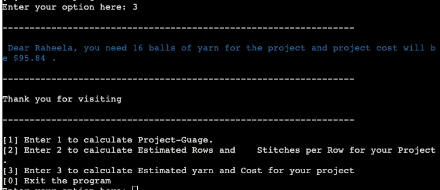

# Guage Calculator:

Gauge calculator is a tool used by those who crochet or knit. It helps calculate the number of rows and stitches per inch, essential for planning projects. To determine your gauge, follow these steps:

* Create a swatch using your desired yarn and hook.
* Measure the swatch's length and width.
* Count the number of rows.
* Count the number of stitches in a row.

Use these measurements to calculate your gauge. It's crucial to maintain the same hook size and yarn for your project as used in the swatch.

## Content:

 [Story](https://github.com/raheelaahmed/guage-calculator?tab=readme-ov-file#story)
 
 [Crochet Guage Calculator](https://github.com/raheelaahmed/guage-calculator?tab=readme-ov-file#crochet-guage-calculator)

 [Flow Chart](https://github.com/raheelaahmed/guage-calculator/blob/main/doc/Flow-Chart.md)
 
 [Calculator Logic](https://github.com/raheelaahmed/guage-calculator?tab=readme-ov-file#calculator-logic)
 
 [Color coding](https://github.com/raheelaahmed/guage-calculator?tab=readme-ov-file#color-coding)
 
 [Sleep timer](https://github.com/raheelaahmed/guage-calculator?tab=readme-ov-file#sleep-timer)
 
 [Guage Calculator on Terminal](https://github.com/raheelaahmed/guage-calculator?tab=readme-ov-file#guage-calculator-on-terminal)
 
 [Content left](https://github.com/raheelaahmed/guage-calculator?tab=readme-ov-file#content-left)
 
 [Debugging and Errors](https://github.com/raheelaahmed/guage-calculator?tab=readme-ov-file#debugging-and-errors)
 
 [Testing](https://github.com/raheelaahmed/guage-calculator?tab=readme-ov-file#testing)
 
 [Development and Deployment](https://github.com/raheelaahmed/guage-calculator?tab=readme-ov-file#development-and-deployment)
 
 [credits](https://github.com/raheelaahmed/guage-calculator?tab=readme-ov-file#credits)

## Story:

If you crochet, you understand the importance of accurate calculations for your project. Making too few or too many stitches can significantly impact the final outcome. Manual calculations are prone to human error.
When I made my first crochet hooded cardigan for a six-month-old baby, I didn't use the correct gauge for the pattern. The finished product was too small, emphasizing the importance of gauge and hook size. This experience inspired me to create a Python calculator to assist fellow crocheters with their calculations.

 ## Crochet-Guage-Calculator:

This calculator can determine the following:

### Gauge: 

Calculate the number of rows and stitches per inch.

### Project Requirements: 

Calculate the number of rows and stitches needed for your project based on desired dimensions.

### Yarn Estimation:

 Estimate the yarn amount required for your project.
### Project Cost: 

Calculate the approximate cost of the project.

## Flow-Chart:

Project Idea at Start was taking input from the user and calculating guage for the project then i and extended the project and introduced more function for the program.
Here is the first chart made from the idea.

chart for the start function after extending the program is given below:

There are 4 more functions, 

* calculate_guage():

 
Calculates the gauge based on swatch measurements. 

*  blanket_row_stitch_calculation():

Calculates rows and stitches needed for the project based on user input.

*  project_cost():

Estimates yarn amount and cost based on project dimensions and yarn information.

*  menu()

Displays a menu with options to choose functionalities and handles user input.

 
## Calculator-Logic:

This calculator has 5 functions listed below:

1: start()
2: calculate_gauge()
3: blanket_row_stitch_calculation()
4: project_cost()
5: menu()

### start():

This function introduces the program to the user, explaining its purpose and functionality. It provides instructions on creating a swatch and gathering necessary measurements: length, width, stitch count, and row count. These measurements are stored as global variables for later calculations within the program.

### calculate_gauge():

Calculates the gauge based on swatch measurements. This function determines the gauge for any project by calculating the stitches and rows per inch based on user-provided swatch data. The math.ceil method rounds up the calculated values to whole numbers. The function then displays the resulting gauge.

### blanket_row_stitch_calculation():

Calculates rows and stitches needed for the project based on user input. This function determines the required number of stitches per row and total rows for a project based on user-specified length and width. It utilizes global variables for calculations and prompts the user for the desired project dimensions. The math.ceil function is employed to round up calculated values to whole numbers. The function outputs the calculated row and stitch counts.

### project_cost():

Estimates yarn amount and cost based on project dimensions and yarn information. This function calculates the approximate yarn required and project cost. It utilizes user-provided yarn weight, swatch dimensions, and project dimensions. The function determines the yarn needed in grams and balls, then calculates the total cost based on the yarn price per 100 grams.

### menu():

Displays a menu with options to choose functionalities and handles user input.
It has option as 1,2,3,0 and while loop is used to to run the option and for Error handling.
* option 1 is for calculate_gauge().
* option 2 is for blanket_row_stitch_calculation().
* option 3 is for project_cost().
* option 0 is for Exit the program.

It print out all the 4 option and calls the function based on the user choice.

## Color-coding:

I have used colorama to change the output color for easy readablity and focus. I have used 4 colors for the program.

1: Green
2: Blue
3: White
4: Red

### Green:

Green color is used for all the input taken from the user.

### Blue: 

Blue color is used to display the result.

### White:

white color is used for the other data and borders. It will be white in black terminal and grey in white terminal.

### Red:

Red color is used for errors.

## Sleep-timer:

I have used sleep timer in my program. Timer is set for 0.5 seconds and 1 second.
1 second is for the output(result) statements and 0.5 for the rest of the program. It help the user to see every part of the program being displayed step by step.

## Guage-Calculator-on-Terminal:

When program start running on the terminal program asks the user to enter the name.

When user press enter after entering the name, then welcome statement is displayed and and the description of the app/program is displayed.

then instructions to use the program are displayed, Make a Swatch and what measurement are need for the program.

then program asks for the user input for length, width, number of stiches per row and total rows on the base on the swatch.

when user press enter after providing all the input options are displayed, user can choose from the given options 1,2,3 and 0 for exit.
on the base on user choice function are called.

If user chooses option 1, program will call calculate_guage() and displays the calculated guage based on the user input.

if user chooses option 2, program will call blanket_row_stitch_calculation() and displays the the result of the calculation based on the user input from swatch and required project dimentions.

if user choose option 3, program will call project_cost() and displays the result of the the calculations for estimated yarn and project cost. 

if user chooses option 0, program will exit and break the loop.

## Content-Left:

This gauge calculator has potential for many more calculations beyond its current capabilities. Due to time constraints, I couldn't implement the following features:

* Calculations for circle shaped projects.
* It can calculate decrese or increase of the stiches for the projects.
* It can do calculation for pre defined different measurements.
* It can calculte how many rows of increasing or decreasing you need to get you desired project width and height.
* It Can do calulation for hats as well.

## Debugging-and-Errors:

### deployment to Heroko error:
  
  Missing required flag app
 
  
#### solution:
  
node.js file was missing, after adding the missing file program was working.

 ### Display delay:

 When program start running, it was asking for user input and then the everything was displayed in one step. I wanted to display the data step be step.

 #### Solution: 

 I have used sleep timer for display delay and set up time delay from 0.5 second to 1 second, it help to display the data step be step.

 ### While loop:

 I have used while loop for handling valueError for user input, but program starting calling the the while loop before function call.

 #### Solution:

 I have used the start function to take all the input from the user and used while loop for each input for error handling.
 I have declared all variable that are taking input from the user as global variable so they can be used in all the function and program will run smoothly, user dont need to re enter the data for any function.

 ### ValueError:

 There was a value error for user input if you enter a number for name, programs was accepting it.
 There was a ValueError for int input aswell. For example if you enter a string or empty input, program give ValueError and exit the program.  

 

#### Solution: 

 I have used while loop for the valueErrors, now program only except valid data as name(String only and it should be at laest 3 characters). 
 If user enter invalid data for int or float data type. program will show error message and ask for the input again until user enters correct input.

 
 
 
 

 ### ValueError for random number in options:

The elif statements in the menu function define the possible options (1, 2, 3, and 0). If a user enters a number outside this range, an error message is displayed, prompting them to choose a valid option. The except ValueError block handles instances where non-numeric input is provided, preventing program crashes and ensuring smooth operation.

## Testing:

I tested the application using a CI Python linter, which identified no errors. However, upon running the code after addressing these linter issues, the program encountered unexpected behavior affecting the break statement, except ValueError block, and the menu() function. To resolve these issues, I re-tested the code after removing the problematic elements, ensuring the program's correct functionality.

Error that were effecting the program when removed as below screenshot.

### Manual-Testing:

| Test      | Pass/Fail| 
|----------|-----|
| Run program | Pass |
| User input for name display| Pass | 
| Welcome statement display| Pass |
| Border display | Pass |
| Program description display | Pass |
| Instructions display | Pass |
| User input for swatch  | Pass |
| ValueError handling | Pass |
| Color coding | Pass |
| Sleep timer | Pass |

### Function-Testing:
 
| Function   | Working | 
|----------|-----|
| Start() | Yes |  
| calculate_gauge() | Yes |  
| blanket_row_stitch_calculation() | Yes |  
| project_cost() | Yes |  
| menu() | Yes |  |
| While stement | Yes |  

All program functions operate correctly. The start function collects user input, which is then utilized by calculate_gauge, blanket_row_stitch_calculation, and project_cost for calculations and output generation. The menu function coordinates these functions based on user choices. Both the start and menu functions employ while loops for error handling and menu navigation, respectively. These loops function as expected.

### Options:

| Option   | Working |
|----------|-----|
| 1 | Yes | 
| 2 | Yes | 
| 3 | Yes |  
| 0 | Yes |  

Option are working fine, program take the user input for option 1, 2, 3, 0.
If user enters "1", program runs "calculate_gauge()" and print out the result/out put. Result is printed out in blue color.
If user enters "2", program runs "blanket_row_stitch_calculation()" and print outs the result.
If user enters "3", program runs "project_cost()" and print out the result.
If user enter "0", program will Exit.

##  Development-and-Deployment:

I have created a repository using Code institute template on GitHub.

I have used Git pod codesapce for project development.

You can clone my repistory using the link below:

[Guage Calculator](https://github.com/raheelaahmed/guage-calculator.git)

### Deployement:

I have use Heroku to deploy my project. Steps to deploy are as follows:

* Login to Heroku.
* go to dashboard.
* click New
* Choose Create New App
* Add App name and select a region
* click Create app
* open Deploy
* select GitHub from Deployment methods
* Search for a repository to connect to
* Click Connect
* Choose a branch to deploy(main)
* Click Deploy Branch
* successfull deployment message displays with view button.
* click view to open App

here is live App link [Crochet Guage Calculator](https://guage-calculator-c29404fb9d92.herokuapp.com/)

 
## credits:

I have created "menu function" following video from youtube, video link is given below.

  [Youtube](https://www.youtube.com/watch?v=63nw00JqHo0)

I have used W3Schools and Code Institute courses for learning.

I would like to thank my mentor, Alan, for appreciating my idea and guiding me throughout the project development. I would also like to thank Amy for testing the project and providing valuable suggestions. Additionally, I am grateful to the Code Institute Tutor Support team for their assistance with the successful deployment on the Heroku platform.

  

