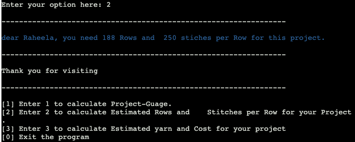

# Guage Calculator:

Guage calculator is a tool used by the people who crochet or knit. They use it to calculate the number rows and number of Stiches per inch, so they can used it for their project, it helps them to calculate how many rows they will be needing for specific length and how many stitches for specific width.
To calculate the guage you have to do the following steps:

* Make a swatch(sample) using your desired staich that you want to use for your project.
* Measure the length and width of the swatch.
* Count the number of rows.
* Count the number of stitches in a row.

You will need above measurements to calculate your guage for the project. 
It is very important to use same hook size and yarn for the project taht you used for swatch.

## Story:
 If you crochet you can understand the importance of calculation for your project. By making less or more stiches whole project goes out of the place. If you do the calculations 
 manually there are chances of human error.
 When i was doing my first crochet jumper by following a pattern. It was a crochet hooded cardigan for the baby(6 month old).
 I did not used the right guage for the pattern and when the project was complete it was measuring a newborn size. so guage and hook size is very important.
 when i got the chance to make a python project. I wanted to make a calculator for my fellow crocheters to make calculation easier.

 ## Crochet Guage Calculator:

This calculator can calculate the following for you:

* It can Calculate Guage for you, number of rows and stiches per inch.
* It can calculate for you how many Rows and how many Stitches per row you need for the project according to your desired length and width of the project.
* It can calculate how many grams of yarn/wool you will be needing for the project.
* It can calculate the cost of the project for you.

## Flow Chart:

 
## Calculator Logic:

This calculator has 5 functions listed below:

1: start()
2: calculate_gauge()
3: blanket_row_stitch_calculation()
4: project_cost()
5: menu()

### start():

This is the function to start the program and describe the users how this program works and what it can do for them.
It has all the instruction that user need to start calculations like they need to make a Swatch and measure the length, width, count the stiches per row and total rows from the swatch.
This function also takes input from the user on the base on swatch. It takes user input for length, width, stitches per row and total rows.
All the input taken from the user is declared as global and will be user in 3 other functions for calculations.

### calculate_gauge():

This function calculates guage for any kind of project. It calculates Stiches per inch Rows per inch based on the input took from the user in start function. math.ceil method is used to round up the calculated numbers as whole number. 
It print out the result(guage for. the project). as well.

### blanket_row_stitch_calculation():

This function is used to calculated Stiches per row Total Rows need for the project based on the user input for length and width of the project.
It uses the input from global variables and use them in calculations and ask user for required project length and required project width and uses the input to calculate the Stiches per row Total Rows need for the project.  It also uses math.ceil to round up the result as whole number.
It print out the result as well.

### project_cost():

This function calculates the estimated yarn and cost for the project based on the input provided be the user. It also uses the input from global variables for the calculations and take input to the amount of yarn used in swatch in grams then takes the input for the required project length and width and caculates how many ball of yarn needed for the project.
It also takes input from the user for price of the yarn per 100g and calculates the cost for the project.
It print out the result fot the estimated yaarn and estimated cost for the project.

### menu():

This the the function menu, it has option as 1,2,3,0 and while loop is usd. to check the conditions.
* option 1 is for calculate_gauge().
* option 2 is for blanket_row_stitch_calculation().
* option 3 is for project_cost().
* option 0 is for Exit the program.

It print out all the 4 option and calls the function based on user choice.

## Color coding:

I have used colorama to change the output color for easy readablity and focus. I have used 3 colors for the program.

1: Green
2: Blue
3: White

### Green:

Green color is used for all the input taken from the user.

### Blue: 

Blue color is used to display the result.

### White:

white color is used for the other data and borders. It will be white in black terminal and grey in white terminal.

## Sleep timer:

I have used sleep timer in my program. Timer is set for 0.5 seconds and 1 second.
1 second is for the output(result) statements and 0.5 for the rest of the program. It help the user to see every part of the program being displayed step by step.

## Guage Calculator on Terminal:

When program start running on the terminal program asks the user to enter the name.

When user press enter after entering the name, then welcome statement is displayed and and the description of the app/program is displayed.

then instructions to use the program are displayed, Make a Swatch and what measurement are need for the program.

then program asks for the user input for length, width, number of stiches per row and total rows on the base on the swatch.

when user press enter after providing all the input options are displayed, user can choose from the given options 1,2,3 and 0 for exit.
on the base on user choice function are called.

If user chooses option 1 the program will start calculating guage based on the input provided by the user and displays the results.

if user chooses option 2, program will ask the user input fot the required program length and width and then display the result.

if user choose option 3, program will calculate the estimated yarn and cost for the project. it will ask for user input for the yarn in gram used for the swatch and required project length and width and then dispayes the result. 
then program will ask for the user input for the price of yarn per 100grams. after press enter program will display the cost for the project.

if user chooses option 0 then program will exit and break the loop other will it will keep running.

## Debugging:

### deployment to Heroko error:
  
  Missing required flag app
 
  
#### solution:
  
node.js file was missing, i added it and it was working fine.

 ### Display delay:

 When program start running it was asking for user input and then the everything was displayed in one step. I wanted to display the data step be step.

 #### solution: 

 I have used sleep timer to fix this problem and set up time delay  from 0.5 second to 1 second, it help to display the data step be step.

 ### While loop:

 I have used while loop for handling valueError for user input, but program was running the while loop before calling of the function.

 #### Solution:

 I have used the start function to take all the input from the user and used while loop for each input for error handling.
 I have declared all variable that are taking input from the user as global variable  so they can be used in all the function and program will run smoothly, user dont need to re enter the data for any function. 

## Testing:

##  Development and Deployment:

I have created a repository using Code institute template on git hub.

I have used Git pod codesapce for project development.

You can clone my repistory using the link below:
https://github.com/raheelaahmed/guage-calculator.git

### Deployement:

I have use Heroku for Deployment.

 
## credits:

I have created menu function following video from youtube.

  https://www.youtube.com/watch?v=63nw00JqHo0

I would like to thank my mentor Alan for appriciating my idea and guiding me throughout the project development. I would like to thank Amy to test the project  for me and for value able suggesstions.

  

